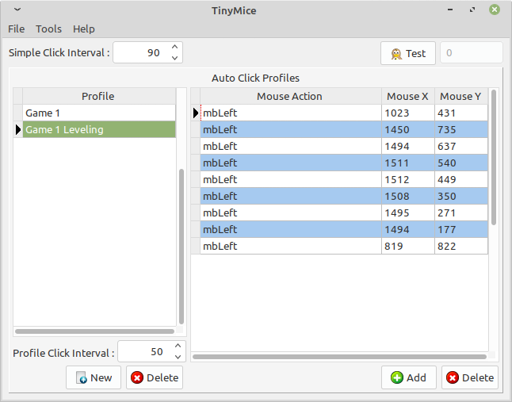
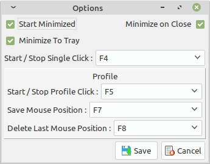
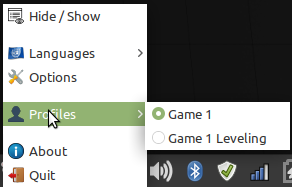

# Description

TinyMice is a simple and light Auto Clicker developed with Lazarus. 

The target operating system is Linux,  Windows users can compile the software by removing codebotctrls from the project dependency. There is also a version of Lazarus for Mac OS, but I will need help to support a Mac OS binary.


# **License**

GNU General Public License [(GPL v3)](https://www.gnu.org/licenses/gpl-3.0.html)


# **Screenshot**







# How To Install

### Download

[Ubuntu](https://github.com/TheLastCayen/TinyMicePackages/raw/master/bin/tinymice_0.5-1.deb)  

[Windows X64](https://github.com/TheLastCayen/TinyMicePackages/raw/master/bin/TinyMice.msi)

### Command

- Ubuntu:  ```sudo dpkg -i tinymice_0.5-1.deb ```
- Fedora : (Coming soon)


# How To Compile

### **Dependency**

##### Compiler && IDE: 

- [Lazarus 2.0.6](https://www.lazarus-ide.org/index.php?page=downloads)
- [FPC 3.0.4](https://www.lazarus-ide.org/index.php?page=downloads)

##### Linux Library: 

- [Libxtst development package](http://www.linuxfromscratch.org/blfs/view/svn/x/x7lib.html)
- [sqlite3 development package](https://www.sqlite.org/download.html)

##### Windows Library: 

- [sqlite3](https://www.sqlite.org/download.html)

  

### Installing Library

- Ubuntu:  `sudo apt-get install libxtst-dev libsqlite3-dev `

- Fedora :  `sudo dnf install libXtst-devel libsqlite3x-devel`

  

### Command

```bash
lazbuild ptinymice.lpi
```


# External Download Links

[Lazarus && FPC](https://www.lazarus-ide.org/)

[Cross.Codebo](https://github.com/sysrpl/Cross.Codebot)

[Sqlite](https://www.sqlite.org/)


